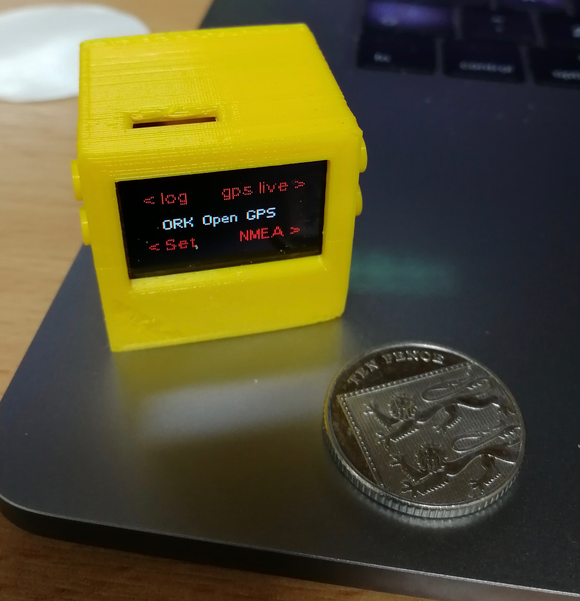

# LSHTM ORK Open GPS Logger

**This work is released on the Creative Commons Sharealike License**
https://creativecommons.org/licenses/by-sa/3.0/deed

Written by Chrissy h Roberts, Emergency and Epidemics Data Kit, London School of Hygiene and Tropical Medicine

This project was supported by the National Institute for Health Research (NIHR) [Policy Research Programme (PR-OD-1017-20001)]. 
The contributions here reflect the  author(s) and not necessarily those of the NIHR or the Department of Health and Social Care.

## Equipment

* The Unit consists of the following hardware
	* [Tinycircuits.com](https://tinycircuits.com/)
		* TinyScreen+ (Processor, OLED & USB in one) *ASM2022*
		* GPS TINYSHIELD *ASD2501-R* 
		* MICROSD TINYSHIELD *ASD2201-R*
		* LITHIUM ION POLYMER BATTERY - 3.7V 290 mAh *ASR00003*
	* Micro SD Card (any capacity, generic)
	* PLA 3D print filament (generic)

## Files

* The repository contains
	* 2019 GPS TINYSCREEN
		* Folder contains Arduino `.ino` file and associated libraries for Tinyscreen+  
		* Main scripts that need to be burned on to Tinyscreen via Arduino IDE
	* Case
		* This folder contains 3D design files
			* Fully modifiable `OpenSCAD` format
			* STL file
	* example_data
		* This folder contains R scripts for analysing data
		* Need to install some libraries (at the top of the script)
		* Example map output

## Instructions
 
Buy all the bits, print the STL file, stick it all together and burn the `.ino` file to the Tinyscreen+. Go outside. Turn it on. 

### Buttons

**Top right** : Show live position  
**Top left** : Start logging  
**Bottom right** : Show raw NMEA feed/ go back to main menu/ stop logging  
**Bottom left** : Set logging interval  

It sometimes takes a while to get the first fix. Only turn on the unit for the first time when you are already outdoors with a clear view of the sky.  

Turn on. Press top right button and wait until first fix.  
Press bottom right button to go back to main menu
Set logging interval, then press bottom right to go back
Press top left to start logging.  

  
